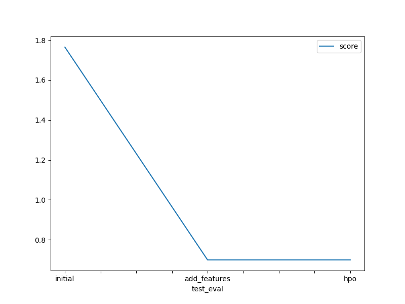

# Report: Predict Bike Sharing Demand with AutoGluon Solution
#### Jessica Gatura

## Initial Training
### What did you realize when you tried to submit your predictions? What changes were needed to the output of the predictor to submit your results?
The output of the predictor needed to have no negative values for the predicions to be submited. Mine did not have any negatives so I did not neet to make any changes.

### What was the top ranked model that performed?
WeightedEnsemble_L3

## Exploratory data analysis and feature creation
### What did the exploratory analysis find and how did you add additional features?
With EDA I found out that the target value, count, was skewed hence the model was prone to bias.
I added more features by splitting the datetim column into year, month and day

### How much better did your model preform after adding additional features and why do you think that is?
The score had an increase of 60.38%
Adding more features provided more data points for my model. Due to this it was able to make better predictions and the score significantly increased.

## Hyper parameter tuning
### How much better did your model preform after trying different hyper parameters?
The model's performance remained contant with 0% improvement.
This indicates that the adjustments made did not lead to an improvement in the model's predictive capabilities. It suggests that the hyperparameters might need more tuning to achieve the optimal configuration for the given dataset and task

### If you were given more time with this dataset, where do you think you would spend more time?
I would spend more time on hyperparameter tuning in order to find the combination of hyperparameters that makes my model make the most accurate predictions.

### Create a table with the models you ran, the hyperparameters modified, and the kaggle score.
|model|num_trials|searcher|num_folds|score|
|--|--|--|--|--|
|initial|-|-|-|1.76476|
|add_features|-|-|-|0.69924|
|hpo|10|random|5|0.69924|

### Create a line plot showing the top model score for the three (or more) training runs during the project.

### Create a line plot showing the top kaggle score for the three (or more) prediction submissions during the project.

## Summary
Further refinement and fine-tuning of hyperparameters may be needed to achieve better performance.
